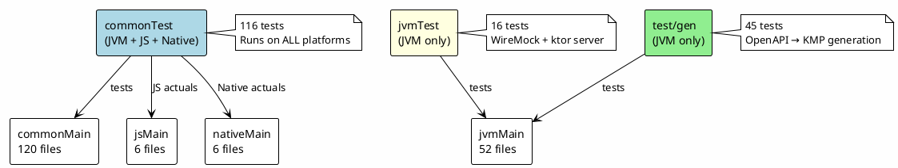

# Test Coverage — api-kmp KMP Module

## Summary

| Category | Tests | JVM | JS (Node) | Native |
|---|---|---|---|---|
| **Unit** (commonTest) | 248 | ✅ | ✅ | pending |
| **Infrastructure** (jvmTest) | 16 | ✅ | — | — |
| **Code Generation** (test) | 84 | ✅ | — | — |
| **Total** | **348** | ✅ | ✅ | pending |

```plantuml
@startuml
!theme plain
skinparam backgroundColor #FEFEFE

package "commonTest (JVM + JS + Native)" {
  [OptionalTest\n66 tests] as OPT
  [PlatformE2eTest\n17 tests] as E2E
  [ContentFormatsTest\n12 tests] as CF
  [KotlinxApiJsonBackendTest\n8 tests] as KB
  [JsonValueSerializerTest\n8 tests] as JVS
  [McpTypesTest\n5 tests] as MCP
}

package "jvmTest (JVM only)" {
  [HttpRetryTest\n10×2 = 20 tests] as HRT
  [KtorServerProtocolTest\n6 tests] as KSP
}

package "test / gen (JVM only)" {
  [MultiProviderGenTest\n14 tests] as MPG
  [VCardRoundTripTest\n11 tests] as VRT
  [ICalRoundTripTest\n6 tests] as IRT
  [AnthropicApiGenTest\n5 tests] as AAG
  [FakerMultiLocaleRoundTripTest\n3 tests] as FMR
  [ComposeEmitterTest\n3 tests] as CET
  [DatabaseEmitterTest\n3 tests] as DET
}

OPT --> [Optional\nexpect/actual]
E2E --> [JSON/CBOR/Proto/MsgPack\nMCP/Errors/Utils/Time]
CF --> [ContentFormat enum]
KB --> [KotlinxApiJsonBackend]
JVS --> [JsonValueSerializer]
MCP --> [McpTypes]
HRT --> [HttpRetry + ClientOptions]
KSP --> [ktor CIO Server\nJSON/SSE/WebSocket]
MPG --> [OpenApiParser + all emitters]
AAG --> [Full Anthropic API\n445 schemas → KMP]
@enduml
```

## Unit Tests (commonTest — all platforms)

### OptionalTest — 66 tests
Covers the `expect class Optional<T>` KMP typealias:
- `isPresent` / `get` / `orElse` / `orElseGet` / `orElseThrow`
- `map` / `flatMap` / `filter` / `ifPresent`
- Edge cases: null, empty, chained transforms
- **JVM**: delegates to `java.util.Optional`
- **JS/Native**: custom `Optional` implementation

### PlatformE2eTest — 17 tests
Cross-platform end-to-end covering every KMP subsystem:
- `json_roundTrip` — KotlinxApiJsonBackend encode/decode
- `contentFormat_json/cbor/protobuf/msgpack_roundTrip` — 4 wire formats
- `jsonValue_toElement_roundTrip` — SDK JsonValue ↔ kotlinx JsonElement bridge
- `mcp_toolDefinition_serializes` / `mcp_textResult` — MCP tool types
- `optional_present` / `optional_empty` — expect/actual Optional
- `apiException_hierarchy` / `apiRetryableException_isRetryable` — error types + Retryable marker
- `checkRequired_passes` / `checkRequired_fails` — Utils validation
- `toImmutable_list` / `contentHash_consistent` — collection helpers
- `currentTimeMillis_positive` — platform time

### ContentFormatsTest — 12 tests
All 4 wire formats via `ContentFormat` enum:
- JSON: round-trip, mediaType, stringFormat
- CBOR: round-trip, mediaType, binary-smaller-than-json
- Protobuf: round-trip, mediaType, compact
- MsgPack: round-trip, mediaType
- Cross-format: `all_formats_registered` (4 entries)

### KotlinxApiJsonBackendTest — 8 tests
kotlinx.serialization-backed `ApiJsonBackend`:
- encode/decode simple model with `@SerialName`
- round-trip nested model
- ignoreUnknownKeys
- coerceDefaults
- parseToJsonElement
- encodePretty (pretty-print)
- decodeViaTypeDescriptor

### JsonValueSerializerTest — 8 tests
SDK `JsonValue` ↔ kotlinx `JsonElement` bridge:
- null, boolean, number, string, array, object round-trips
- nested object round-trip
- `fromJsonElement` primitive type detection

### PatchEventTest — 4 tests
Component mutation events (JSON Patch, RFC 6902):
- `patchOperation_creation` — replace op with path + value
- `patchOperation_serialization` — round-trip via kotlinx.serialization
- `patchOperation_move` — move op with from field
- `patchOperation_remove` — remove op (no value)

### UiSchemaRegistryTest — 66 tests
Comprehensive OpenAPI type+format → HTML input type mapping:
- Standard formats: email→email, phone→tel, date→date, uri→url (8 tests)
- Numeric: int32 step, double step (2 tests)
- Financial/Identity: credit-card, isbn (2 tests)
- Locale: currency/country/language/timezone → select (6 tests)
- Measure: length(m)/mass(kg)/temperature(°C) with units (5 tests)
- vCard (RFC 6350): fn, tel, email, adr, photo, bday, note, geo (8 tests)
- iCalendar (RFC 5545): dtstart, status, partstat, role, rrule, priority (7 tests)
- Geo: geo-picker, lat range, geojson (3 tests)
- Custom: color, markdown, cron, json (4 tests)
- Type defaults: string→text, integer→number, boolean→checkbox (4 tests)
- Registry completeness (2 tests)
- Wire format negotiation: JSON + CBOR + Protobuf + MsgPack round-trips (4 tests)
- maxLength: short→input, long→textarea, vcard-note, markdown (4 tests)
- SQL type resolution: JSONB, INTEGER, REAL, BOOLEAN, VARCHAR(N), TEXT (7 tests)

### BarcodeTypesTest — 26 tests
QR code / barcode symbology integration (qrkit):
- Factory: qrCode, uriQrCode, code128, code39, ean13, upcA, isbn, dataMatrix, pdf417 (9 tests)
- fromFormat auto-detection: all 11 format strings (11 tests)
- UiSchemaRegistry integration: barcode widgets + category (3 tests)
- Serialization: JSON + CBOR round-trip, symbology serial names (3 tests)

### MenuPermissionTest — 24 tests
JWT claims → menu UI permission-driven generation:
- Parsing: full, wildcard, partial, roundTrip (4 tests)
- Matching: exact, wildcard action/category, wrong obj/action (5 tests)
- JWT claims: array, CSV, missing (3 tests)
- MIME: png, puml, pdf, category fallback, wildcard (5 tests)
- File extension, operationId (2 tests)
- Menu tree: groups by object/action/category, wildcard leaf, serializes (5 tests)

### JsonFormsSchemaTest — 12 tests
JSON Schema + UI Schema generation + PatchEvent negotiation:
- JSON Schema: basic, $ref, descriptions (3 tests)
- UI Schema: vertical, FK navigation, categorized (3 tests)
- Bundle serialization: JSON, CBOR PatchOp (2 tests)
- PatchEvent: formFieldChanged, JSON negotiation, CBOR/Proto, compact (4 tests)

### McpTypesTest — 5 tests
Provider-agnostic MCP tool definitions:
- `ToolDefinition` serialization + round-trip
- `ToolCallRequest` serialization
- `textResult` / `errorResult` factory functions

## Infrastructure Tests (jvmTest — JVM only)

### HttpRetryTest — 20 tests (10 × 2 sync/async)
WireMock-based HTTP retry integration tests:
- Basic execute (no retry needed)
- Idempotency header injection (`stainless-retry-<uuid>`)
- Retry-After header (RFC 1123 date) with clock control
- Retry-After-Ms header (milliseconds)
- Overwritten retry count header preservation
- Retryable exception handling (ApiRetryableException)
- Exponential backoff (0.5s × 2^n, capped at 8s, jitter)
- Exponential backoff cap verification (6 retries)
- Retry-After-Ms priority over Retry-After
- Unparseable Retry-After fallback to exponential

All tests use `ClientOptions.builder()` to exercise the production
retry wiring path, not direct `withRetry()` calls.

### KtorServerProtocolTest — 6 tests
ktor `testApplication` host (no real network):
- `GET JSON` — serialized `@Serializable` model response
- `POST JSON` — request body deserialization + modified response
- `GET 404` — unknown path handling
- `SSE stream` — 3 ServerSentEvents with event types + JSON data
- `WebSocket echo` — bidirectional text round-trip
- `WebSocket JSON streaming` — server streams 3 JSON objects, client deserializes

## Code Generation Tests (test — JVM only)

### AnthropicApiGenTest — 5 tests
Full Anthropic OpenAPI spec (15,757 lines, 450 schemas, 31 paths):
- Parse spec: validates servers, schemas, paths
- Generate KMP models: 445 `@Serializable` data classes with `@JsonProperty`
- Generate services: `suspend fun` methods from 47 paths
- Generate MCP tools: `tools.json` + `McpServer` + `McpClient`
- Failure rate assertion: <5% schema generation failures

### MultiProviderGenTest — 14 tests
Multi-provider code generation:
- Petstore OpenAPI: 5 WireMock tests (GET/POST Pet, List, Inventory, Category)
- CalDAV OpenAPI: parse + generate
- Google Calendar API: parse + generate
- Amazon SP-API: parse + generate (69 models)
- Server URL extraction from `servers:` block
- McpEmitter: runnable Kotlin McpServer + McpClient alongside tools.json

### ComposeBindingTest — 16 tests
Per-target Compose widget bindings + Wire proto content negotiation:
- Material3 (6): textField, checkbox, button, textButton, listItem, layout
- WebDOM (6): Input, CheckboxInput, HTML Button, anchor, Li, Div(flexbox)
- Cross-binding (2): target names differ, same input → different widgets
- Proto negotiation (2): all 4 ContentFormats, proto compact round-trip

### MasterDetailFkTest — 15 tests
Master-detail layout + FK navigation per target:
- Layout: material3 weighted boxes, webDom flexbox row (2)
- FK links: material3 TextButton vs webDom anchor, cross-target diff (3)
- Detail fields: material3 Text vs webDom P (2)
- Submit/Add/Empty: per-target (6)
- Full scenarios: pet-owner (material3), order-product (webDom) (2)

### ComposePlaywrightTest — 8 tests
Playwright-style DOM assertions on generated Compose code:
- Form: TextField/comment, Checkbox/comment, FK TextButton
- List: items parameter, Detail: entity fields
- MasterDetail: combines List + Detail
- Multi-schema: separate files, Snapshot: full Contact form

### ComposeEmitterTest — 3 tests
Compose Multiplatform UI generation:
- Form + List + Detail + MasterDetail `@Composable` from object schema
- Skip schemas with <2 properties
- Skip non-object schemas (enums)

### DatabaseEmitterTest — 3 tests
Database schema generation:
- Exposed table (Kotlin) + SQLDelight `.sq` from object schema
- jsonb columns for RFC types (VCardContact, ICalEvent)
- Skip non-object schemas

### VCardRoundTripTest — 11 tests
vCard (RFC 6350) round-trip validation:
- ezvcard parse → Wire VCardContact → serialize
- Multi-locale names (23 locales via kt-faker)
- Phone number formatting
- Address components
- Photo/logo handling

### ICalRoundTripTest — 6 tests
iCalendar (RFC 5545) round-trip:
- VEVENT create → serialize → parse
- VTODO, VJOURNAL
- Recurring events (RRULE)
- Attendee/organizer
- Alarm (VALARM)

### FakerMultiLocaleRoundTripTest — 3 tests
Multi-locale test data generation via kt-faker:
- 23 locales generate valid vCards
- Phone numbers validate per locale
- Addresses format per locale

## Architecture

## Untested Packages

| Package | Files | Reason |
|---|---|---|
| `kotlinx.kmp.util.async` | 1 | `KmpAsync.kt` — expect declarations only, tested indirectly via HttpRetryTest |
| `kotlinx.kmp.util.core.annotations` | 1 | `Annotations.kt` — annotation-only file, no runtime logic |
| `kotlinx.kmp.util.core.component` | 6 | ✅ `PatchEventTest` 4, `JsonFormsSchemaTest` 12, `UiSchemaRegistryTest` 66, `MenuPermissionTest` 24, `BarcodeTypesTest` 26 |
| `kotlinx.kmp.util.core.handlers` | 1 | `StreamHandler.kt` — tested indirectly via ktor server protocol tests |

## Coverage by Subsystem

| Subsystem | Direct Tests | Indirect Coverage |
|---|---|---|
| JSON serialization (kotlinx) | 8 + 12 + 17 | via all gen tests |
| JSON serialization (Jackson) | — | via anthropic-java-core 2,682 tests |
| JsonValue ↔ JsonElement | 8 | via gen tests |
| HTTP retry | 20 | — |
| ktor server (JSON/SSE/WS) | 6 | — |
| MCP tool types | 5 | via AnthropicApiGenTest |
| Optional (KMP) | 66 | — |
| Content formats (4) | 12 | — |
| UI Schema registry | 66 | — |
| Barcode/QR (qrkit) | 26 | — |
| JWT menu permissions | 24 | — |
| JSON Forms + PatchEvent | 12 + 4 | — |
| Compose bindings (Material3/Web) | 16 + 15 + 8 | — |
| Error hierarchy | 2 (in E2E) | via ErrorHandlingTest in anthropic-java-core |
| Code generation (api-gen) | 45 | — |
| Platform time | 1 (in E2E) | via HttpRetryTest |
| Utils (checkRequired etc.) | 3 (in E2E) | via model tests |
